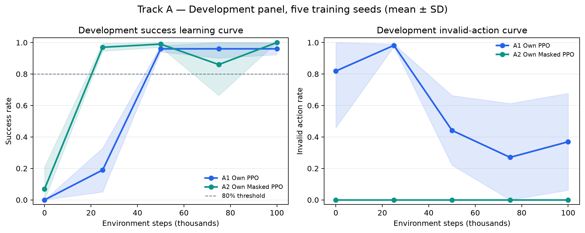
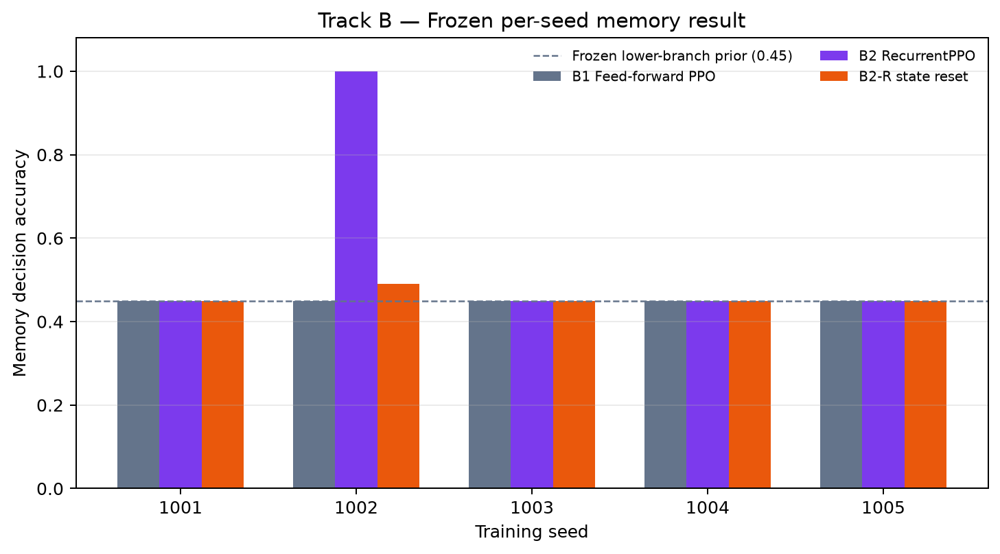
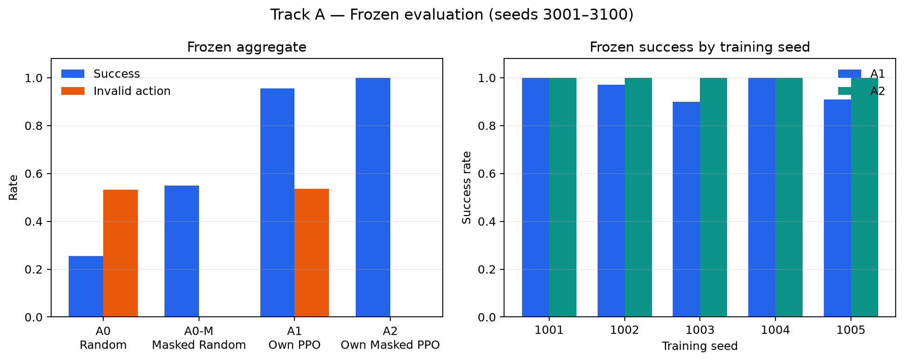
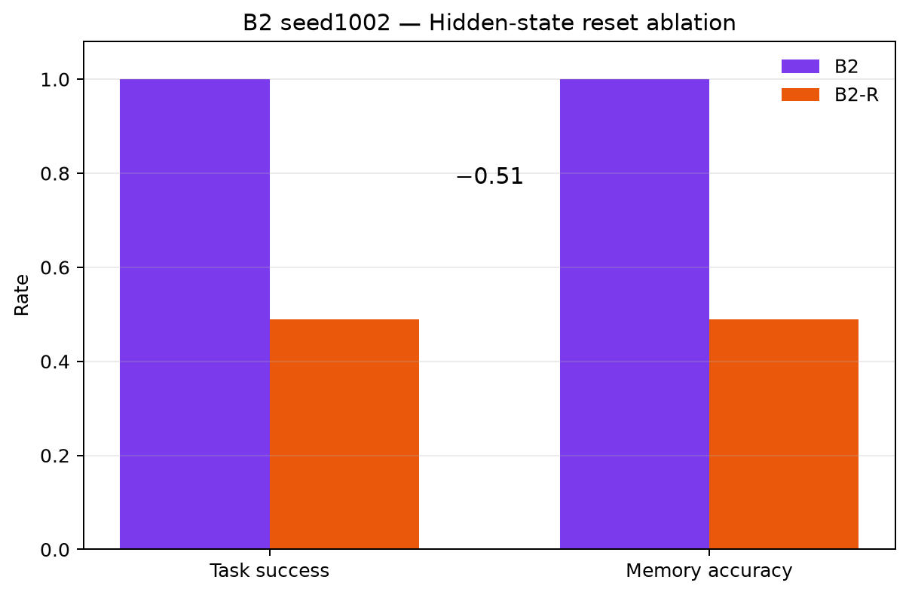

# GameAgent-RL

**Reinforcement learning and evaluation for game agents under dynamic action constraints and partial observability.**

GameAgent-RL is a controlled MiniGrid study built around two questions: whether legality-only action masking improves PPO without leaking planning information, and whether a recurrent policy reliably learns cue-dependent memory. The repository includes a from-scratch PyTorch PPO and Masked PPO implementation, mature reference baselines, multi-seed training, frozen evaluation, causal hidden-state ablation, and replay evidence.

## Research tracks

### Track A — Constrained Action Policy Learning

`MiniGrid-DoorKey-5x5-v0` uses a reduced five-action policy space: left, right, forward, pickup, and toggle. A dynamic legality mask answers only whether an action is currently executable; it does not encode a route, optimal direction, goal location, or hidden map state.

- A0: Random
- A0-M: Masked Random
- A1: Own Vanilla PPO
- A2: Own Masked PPO

A1 and A2 share the frozen `ppo_v1_frozen` network, optimizer, PPO hyperparameters, observations, rewards, and 100k-step budget. Their only core algorithmic difference is distribution support over legal actions.

### Track B — Memory under Partial Observability

`MiniGrid-MemoryS11-v0` compares feed-forward PPO with RecurrentPPO and a hidden-state reset ablation. Research Change 001 fixes only the initial agent pose so the native cue is visible at reset; native map generation, cue/target randomness, rewards, observations, actions, and termination are preserved.

- B0: Random
- B1: SB3 PPO
- B2: SB3-Contrib RecurrentPPO
- B2-R: the same B2 checkpoint with hidden/cell state reset when the cue leaves view

## Experimental protocol

- Policy input: deterministic one-hot encoding of the local categorical image plus direction; mission text is excluded.
- Training seeds: `1001–1005`.
- Development panel: used only for learning curves and sample-efficiency metrics.
- Frozen panel: environment seeds `3001–3100`; final checkpoints only; deterministic learned-policy evaluation.
- Track A budget: 100k environment steps per training seed.
- Track B budget: 500k environment steps per training seed.
- Native reward; no reward shaping, post-hoc tuning, checkpoint selection, or extra training from Frozen results.

## Core results

| Track A condition | Frozen success | Mean return | Invalid action rate |
|---|---:|---:|---:|
| A0 Random | 0.254 | 0.1115 | 0.5316 |
| A0-M Masked Random | 0.550 | 0.2829 | 0.0000 |
| A1 Own PPO | 0.956 | 0.9219 | 0.5356 |
| A2 Own Masked PPO | **1.000** | **0.9641** | **0.0000** |

A2 matched or improved Frozen success for every paired training seed, eliminated illegal actions, raised mean normalized Development AUC from `0.6475` to `0.8388`, and reached 80% Development success at 25k rather than 50k steps.

| Track B condition | Frozen success | Decision reach | Memory accuracy |
|---|---:|---:|---:|
| B0 Random | 0.330 | 0.650 | 0.508 |
| B1 Feed-forward PPO | 0.450 | 1.000 | 0.450 |
| B2 RecurrentPPO | 0.560 | 1.000 | 0.560 |
| B2-R state reset | 0.458 | 1.000 | 0.458 |

Track B is intentionally reported as an unstable result: B2 seed1002 reached `1.00` memory accuracy and fell to `0.49` after state reset, providing policy-specific causal memory-use evidence. The other four recurrent seeds stayed at the `0.45` fixed-branch prior. RecurrentPPO therefore did not establish stable cross-seed memory competence.

Full tables, hypothesis closure, interpretation, and claim boundaries are in [RESULTS.md](RESULTS.md).

## Figures and replays

| Track A | Track B |
|---|---|
|  |  |
|  |  |

Representative public replays:

- [A1 invalid-action-heavy](assets/replays/track-a-a1-invalid-heavy.gif)
- [A2 success](assets/replays/track-a-a2-success.gif)
- [B2 recurrent success](assets/replays/track-b-b2-success.gif)
- [B2-R paired memory failure](assets/replays/track-b-b2r-failure.gif)

Replays explain behavior; aggregate metrics remain the research evidence.

## Implementation

The own PPO stack under `src/gameagent_rl/ppo/` implements a shared Actor-Critic MLP, categorical and masked categorical policies, rollout storage, correct terminated/truncated bootstrapping, GAE, clipped PPO objective, entropy/value losses, advantage normalization, minibatch multi-epoch updates, gradient clipping, and checkpoint save/load.

```text
src/gameagent_rl/envs/       Track A/B contracts and preprocessing
src/gameagent_rl/ppo/        Own PPO, Masked PPO, evaluation
configs/                     Frozen and reference configurations
experiments/                 Training, evaluation, and summary entry points
tests/                       Environment and PPO contract tests
assets/                      Public figures and representative replays
```

Local checkpoints, raw metrics, development records, and internal research documents are intentionally excluded from the public repository. Frozen aggregate evidence is preserved in [RESULTS.md](RESULTS.md).

## Reproduction

Native Windows, Python 3.12, and [`uv`](https://docs.astral.sh/uv/) are used. Dependencies and the project environment remain local.

```powershell
$env:UV_CACHE_DIR = "$PWD\.uv-cache"
uv sync --group dev
uv run pytest -q
```

Representative training commands:

```powershell
uv run python experiments/run_track_a_formal.py a1 --seed 1001
uv run python experiments/run_track_a_formal.py a2 --seed 1001
uv run python experiments/run_track_b_formal.py b1 --seed 1001
uv run python experiments/run_track_b_formal.py b2 --seed 1001
```

Frozen evaluation requires all final checkpoints:

```powershell
uv run python experiments/run_track_a_frozen.py
uv run python experiments/run_track_b_frozen.py
```

Frozen outputs are terminal evaluation evidence and must not be used for further training or tuning. Raw local summaries are stored at `artifacts/track_a/frozen_evaluation/frozen_summary.json` and `artifacts/track_b/frozen_evaluation/frozen_summary.json`.

## Conclusions and limitations

Legality-only masking was a clean, effective intervention on DoorKey-5x5: it removed illegal actions and improved learning efficiency, final success, and completion efficiency under the frozen protocol. This is a task-specific result, not a general claim for all constrained RL problems.

Recurrence was capable of learning and causally using the MemoryS11 cue, but this occurred in only one of five training seeds. The experiment supports a capability claim for that policy and exposes strong optimization instability; it does not support stable recurrent memory learning across seeds. MemoryS13, own recurrent PPO, recurrent-plus-masking, CNN policies, and broader environment generalization are outside V1.

## License

Licensed under the [Apache License 2.0](LICENSE).
